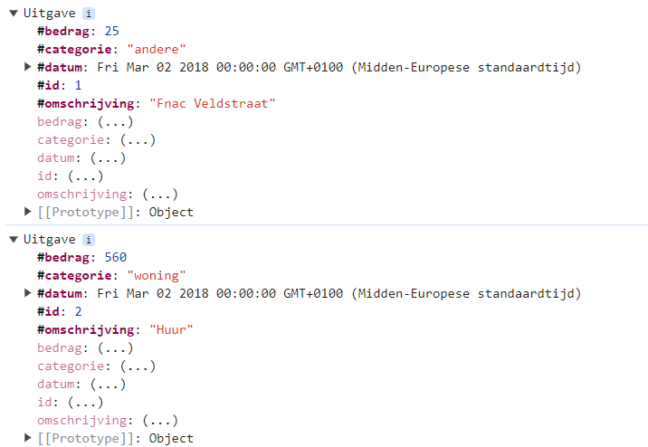

# Oefeningen Hoofdstuk 07 - DOM

## Oefening 1 VDAB

De werking van de webpagina is als volgt

- Geef een zoekterm in het tekstvak in. Klik op de knop Zoekterm toevoegen =>
  - De zoekterm wordt toegevoegd aan het lijstje bovenaan indien deze nog niet bestaat en een waarde bevat.<br>
    
  - Alle vacatures waarvan de titel één of meerdere van de zoektermen bevat, worden getoond. Het zoeken is niet hoofdlettergevoelig
- Als bij een zoekterm op  geklikt wordt, wordt de zoekterm uit het lijstje bovenaan verwijderd en wordt de lijst van vacatures bijgewerkt.
- Als de pagina geladen wordt, moeten de laatst gekozen zoektermen onmiddellijk verschijnen en de overeenkomstige vacatures worden onmiddellijk getoond.


### Deel 1: class Vacature (Vacature.js)

Voorzie een klasse **Vacature** (file Vacature.js). Elke vacature heeft id, titel, functieomschrijving, profiel, bedrijf en plaats.

Voorzie publieke getters voor elke private property.

Voeg een methode **bevatZoekterm (zoektermen)** toe aan de klasse Vacature. Hierbij is zoektermen een array van strings en deze methode retourneert true indien de titel van de vacature één of meerdere van de zoektermen bevat. Dit mag niet hoofdlettergevoelig zijn.

Test de code door 'testcode.html' te openen met de Live Server. TESTCODE DEEL 1, moet onderstaand resultaat geven in de console.


### Deel 2: class Vacature repository (vacatureRepository.js)

Implementeer de methode **voegVacatureToe** om één vacature toe te voegen aan de array van vacatures. Maak gebruik van de meegegeven parameters.

Test de code door 'testcode.html' te openen met de Live Server. In TESTCODE DEEL 2 worden de 4 vacatrures uitgeschreven en bekom je onderstaand resultaat in de console.
De undefined is afkomstig van de filterOpZoekTermen-methode die momenteel nog niets retourneert.


Implementeer de methode **filterOpZoekTermen** die de vacatures retourneert die voldoen aan één of meerdere van de meegegeven zoektermen.

Controleer of de testcode de gewenste resultaten geeft.


### Deel 3: class VdabComponent (VdabComponent.js)

In de constructor van de class VdabComponent voeg je code toe zodat indien er op de knop Zoekterm geklikt wordt een, nog niet bestaande, zoekterm wordt toegevoegd:

- indien de zoekterm al bestaat of leeg is, geef je een gepaste melding weer op de pagina, maak gebruik van het span-element id#message.
- indien de zoekterm nog niet bestaat, maak je gebruik van de methode **voegZoektermToe** om de zoekterm toe te voegen en op te slaan in 'local storage'. Voor dit laatste moet je eerst de methode **setZoektermenInStorage** implementeren (de gebruikte 'key' is VDABZoektermen).<br>
  
- toon het resultaat op je pagina via de methode **#toHtml()**. Voorlopig worden de zoektermen nog niet getoond omdat de methode **#zoektermenToHtml** nog niet geïmplementeerd is.
- vergeet niet het invoervak van je pagina weer leeg te maken.

Test deze code eventueel door de zoektermen in de console weer te geven of via debugging.


Implementeer de methode **#zoektermenToHtml** om de zoektermen bovenaan te laten zien:

- hiertoe moet je de onderstaande html-code dynamisch gegenereren.  
  
- Als op  wordt geklikt moet de zoekterm verwijderd worden. Maak hierbij gebruik van de methode **#verwijderZoekterm** om de zoekterm te verwijderen. Implementeer deze methode, zorg ervoor dat de zoektermen in 'local storage' worden aangepast. Werk ook de webpagina bij door opnieuw **#toHtml()** op te roepen.


Implementeer de methode **#getZoektermenFromStorage** om de zoektermen op te vragen uit de storage.
Zorg ervoor dat bij het opstarten van de applicatie de zoektermen uit 'local storage' worden opgehaald door de methode **#getZoektermenFromStorage** op te roepen in de constructor van de class VdabComponent.


## Oefening 2 Bank

Op de officiële KBC website kan je een overzicht krijgen van je uitgaven verdeeld over verschillende categorieën. De bedoeling van deze oefening is dat we een sterk vereenvoudigde versie hiervan maken.

Aan de linkerkant verschijnt een overzicht van alle uitgaven. Aan de rechterkant maken we gebruik van een canvas om een kolomgrafiek te laten zien. Hierop wordt de procentuele verdeling van de uitgaven uitgezet. In dit voorbeeld zijn er 4 categorieën: andere, vervoer, voeding en woning

- totaal bedrag van de uitgaven = 800 EUR
- categorie: andere = 40 EUR => 5% van het totaal bedrag
- categorie: vervoer = 80 EUR => 10% van het totaal bedrag
- categorie: voeding = 120 EUR => 15% van het totaal bedrag
- categorie: woning = 560 EUR => 70% van het totaal bedrag


### Deel 1 - De klasse Uitgave

Voorzie een klasse **Uitgave** (Uitgave.js). Elke uitgave bestaat uit een id, datum, bedrag, omschrijving en een categorie. Voorzie publieke getters.

Test de code door 'testcode.html' te openen met de Live Server. TESTCODE DEEL 1, moet onderstaand resultaat geven in de console.



### Deel 2 - De klasse **UitgavenRepository** (UitgavenRepository.js).

De methode **#uitgavenOpvullen** is al geïmplementeerd en wordt uitgevoerd in de constructor van **UitgavenRepository**. Deze methode maakt gebruik van de methode **#voegUitgaveToe**. Implementeer de methode **#voegUitgaveToe** om één uitgave toe te voegen aan de array van uitgaven.

Test de code door 'testcode.html' te openen met de Live Server. TESTCODE DEEL 2, moet onderstaand resultaat geven in de console. De 7 uitgaven moeten uitgeschreven worden. De undefined's zijn afkomstig van de functies die momenteel nog niets retourneren.


Implementeer de methode **geefCategorieen** die een alfabetisch gesorteerde array van de unieke categorieën retourneert.

Controleer of de testcode het gewenste resultaat geeft.


Implementeer de methode **totaalBedragUitgaven** die het totale bedrag van de uitgaven retourneert. Hier moet je verplicht gebruikmaken van de array methode reduce().

Controleer of de testcode het gewenste resultaat geeft.


Implementeer de methode **uitgavenPerCategorie** die het totale bedrag van de uitgaven voor de opgegeven categorie retourneert.

Controleer of de testcode het gewenste resultaat geeft.


### Deel 3 Klasse BankComponent(BankComponent.js).

Bekijk de implementatie van de functie **datumNotatie** in de file BankComponent.js. Deze functie zorgt ervoor dat een datum wordt uitgeschreven in het formaat: **Maandag 8/3/2018**.

Implementeer de methode **getAantalBezoekenFromStorage**. Deze functie wordt opgeroepen in de constructor van **BankComponent** en wordt dus uitgevoerd telkens de website wordt bezocht. Deze functie moet het aantal keer dat de website werd bezocht ophalen uit de storage ('key' **aantalBezoeken**) en met één verhogen. Als er nog geen 'key' **aantalBezoeken** aanwezig is in storage moet **#aantalBezoeken** ingesteld worden op **1**.

Implementeer de functie **setAantalBezoekenInStorage** die het aantal keer dat de website werd bezocht wegschrijft naar de storage.

Voeg in de methode **#tekstToHtml#** code toe om het aantal bezoeken weer te geven op de webpagina.

Test de website. Telkens als je de webpagina vernieuwt moet het aantal keer dat je de website bezocht hebt verhogen.

Implementeer de methode **#tekstToHtml** verder. Onderstaande html-code moet dynamisch gegenereerd worden. Per categorie komt er een andere afbeelding: andere.png / vervoer.png / voeding.png / woning.png. De omschrijving staat altijd in hoofdletters.


## Oefening 3 Boeken

De webpagina bevat een overzicht van je boeken. Sommige boeken heb je reeds gelezen en worden getoond in een roze kader. De boeken die je nog niet las staan in een zwart kader. Wanneer je op een boek klikt dat je nog niet las verandert de kleur. Wanneer je klikt op een reeds gelezen boek verandert er niets. De boeken die je reeds las, worden bijgehouden in de storage. Zo krijg je telkens het correcte overzicht wanneer je de webpagina opent.

Op je boekenplank zie je telkens maar 6 van je boeken. Onder de boeken bevindt zich een balk voor de navigatie. Door te klikken op 'volgende' of 'vorige' krijg je de volgende of de vorige 6 boeken te zien.


De derde pagina van de boekenplank, bevat boeken 13 tem 18 van alle boeken.
De gelezen boeken staan in een roze kader.

### Deel 1 – De class Boek

Een boek heeft een id, een titel een afbeelding. De klasse is reeds geïmplementeerd.

```
class Boek {
  #id;
  #titel;
  #afbeelding;
  constructor(id, titel, afbeelding) {
    this.#id = id;
    this.#titel = titel;
    this.#afbeelding = afbeelding;
  }

  get id() {return this.#id;}
  get titel() {return this.#titel;}
  get afbeelding() {return this.#afbeelding;}
}
```

### Deel 2 – De boekenrepository

De boekenrepository bevat een lijst boeken (een Array). De constructor maakt een nieuwe lijst aan en vult deze meteen op met boeken. Dit is reeds geïmplementeerd.

```
class BoekenRepository {
  #boeken = [];
  constructor() {
    this.boekenVullen();
  }

  get boeken() {
    return this.#boeken;
  }

  voegBoekToe(id, titel, afbeelding) {
    this.#boeken.push(new Boek(id, titel, afbeelding));
  }

  boekenVullen() {
    boeken.forEach(([id, titel, afb]) => this.voegBoekToe(id, titel, afb));
  }

 ...

}
```

Aan de boekenrepository kan je een aantal boeken vragen. Deze methode **geefBoeken(vanafBoek, aantalBoeken) { ... }** moet je zelf implementeren. Je geeft aan vanaf het hoeveelste boek (zero-based) en hoeveel boeken je wenst.

### Deel 3 – BoekenComponent - storage

In de component wordt een lijst met de id's (een Set) van de gelezen boeken bijgehouden in de private property **#gelezenBoeken**. De methode **#voegGelezenBoekToe** is reeds gegeven.

Implementeer de twee methodes om de gelezen boeken op te slaan en op te halen uit de storage. Gebruik 'gelezenBoeken' als 'key' bij het wegschrijven van de property **#gelezenBoeken** naar de storage.

- De methode **#getGelezenBoekenFromStorage** haalt de lijst met id's van gelezen boeken op uit de storage.
- De methode **#setGelezenBoekenInStorage** plaatst de lijst van id's van gelezen boeken in de storage

### Deel 4 – toHTML

Implementeer nu de methode **#boekenToHtml** verder. Deze functie genereert de boekenplank. Deze bevat 6 boeken voor de actievePagina (enkel op de laatste pagina kunnen er eventueel minder dan 6 boeken staan). Zorg dat wanneer er geklikt wordt op een nog niet gelezen boek de methode **#voegGelezenBoekToe** wordt aangeroepen met het juiste argument. Gelezen boeken reageren niet op een klik.
Hieronder zie je de HTML die je moet genereren binnen de div met class "row".


