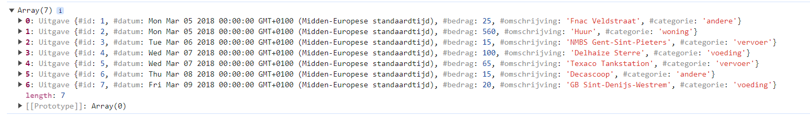

# Oefeningen DOM

## Oefening 1 VDAB 

De werking van de webpagina is als volgt

- Geef een zoekterm in het tekstvak in. Klik op de knop Zoekterm toevoegen =>
  - De zoekterm wordt toegevoegd aan het lijstje bovenaan indien deze nog niet bestaat en een waarde bevat.
  - Alle vacatures waarvan de titel één of meerdere van de zoektermen bevat, worden getoond. Het zoeken is niet hoofdletter gevoelig
- Als bij een zoekterm op X geklikt wordt, wordt de zoekterm uit het lijstje bovenaan verwijderd en wordt de lijst van vacatures bijgewerkt.
- Als de pagina geladen wordt, moeten de laatst gekozen zoektermen onmiddellijk verschijnen en de overeenkomstige vacatures worden onmiddellijk getoond.

Deel 1: Vacature.
Voorzie een klasse Vacature. Elke vacature heeft id, titel, functieomschrijving, profiel, bedrijf en plaats.

Voorzie de nodige getters en setters indien nodig.

Voorzie een functie bevatZoekterm(zoektermen). Deze functie retourneert true indien de titel van de vacature één of meerdere van de zoektermen bevat. Dit mag niet hoofdlettergevoelig zijn.

Test de code door in de init functie de testcode voor Deel 1 uit commentaar te zetten. Zet de testcode vervolgens weer in commentaar.

Deel 2: Vacature repository

Implementeer de methode voegVacatureToe om één vacature toe te voegen aan de array van vacatures. Maak gebruik van de meegegeven parameters.

Test de code door in de init – functie de testcode voor Deel 2 uit commentaar te zetten. De 4 vacatures moeten uitgeschreven worden. De undefined is afkomstig van de filterOpZoekTermen methode die momenteel nog niets retourneert.

Implementeer de methode filterOpZoekTermen die de vacatures retourneert die voldoen aan één of meerdere van de meegegeven zoektermen.

Controleer of de testcode de gewenste resultaten geeft. Zet de testcode voor Deel 2 vervolgens weer in commentaar.

Deel 3: VdabApp

Zorg ervoor dat in de init functie een VdabApp object wordt aangemaakt.
Indien op de knop Zoekterm wordt geklikt moet de zoekterm toegevoegd worden.
Maak gebruik van de VdabApp methode voegZoektermToe.

Implementeer de methode voegZoektermToe.

- de zoekterm mag nog niet bestaan of leeg zijn. Geef een gepaste melding weer op de pagina, maak gebruik van het span-element met id=message.
- voeg, indien aan bovenstaande voorwaarde is voldaan, toe aan de zoektermen en sla de termen lokaal op. Voor dit laatste moet je eerst de methode setZoektermenInStorage implementeren (de gebruikte sleutel is VDABZoektermen).
- toon het resultaat op je pagina via de methode showResultaat. Voorlopig worden de zoektermen nog niet getoond omdat deze methode (zoektermenToHtml) nog niet geïmplmenteerd is.
- vergeet niet het invoervak van je pagina weer leeg te maken.

Test deze code eventueel door de zoektermen in de console weer te geven of via debugging.

Implementeer de methode zoektermenToHtml om de zoektermen bovenaan te laten zien.

- De onderstaande html code wordt dynamisch gegenereerd.  
  
- Als op X wordt geklikt, wordt de zoekterm verwijderd.
- Maak gebruik van de methode verwijderZoekterm om de zoekterm te verwijderen. Implementeer deze methode, zorg ervoor dat ook lokaal de zoektermen worden aangepast en toon het resultaat op de pagina.

Zorg ervoor dat bij het opstarten van de applicatie de zoektermen lokaal worden opgehaald, maak hiervoor gebruik van de methode getZoektermenFromStorage om de zoektermen op te vragen uit de storage. 

## Oefening 2 Bank 

Op de officiële KBC website kan je een overzicht krijgen van je uitgaven verdeeld over verschillende categorieën. De bedoeling van deze oefening is dat we een sterk vereenvoudigde versie hiervan maken.

Aan de linkerkant verschijnt een overzicht van alle uitgaven. Aan de rechterkant maken we gebruik van een canvas om een kolomgrafiek te laten zien. Hierop wordt de procentuele verdeling van de uitgaven uitgezet. In dit voorbeeld zijn er 4 categorieën: andere, vervoer, voeding en woning

- totaal bedrag van de uitgaven = 800 EUR
- categorie: andere = 40 EUR => 5% van het totaal bedrag
- categorie: vervoer = 80 EUR => 10% van het totaal bedrag
- categorie: voeding = 120 EUR => 15% van het totaal bedrag
- categorie: woning = 560 EUR => 70% van het totaal bedrag

Deel 1
Voorzie een klasse Uitgave. Elke uitgave bestaat uit een id, datum, bedrag, omschrijving en een categorie. Voorzie getters en setters

Test de code door in de init – functie de testcode voor Deel 1 uit commentaar te zetten. Zet de testcode vervolgens weer in commentaar.

Deel 2
Zet de bestaande code voor UitgavenRepository uit commentaar.

Implementeer de methode voegUitgaveToe om één uitgave toe te voegen aan de array van uitgaven. Maak gebruik van de meegegeven parameters.

Test de code door in de init – functie de testcode voor Deel 2 uit commentaar te zetten. De 7 uitgaven moeten uitgeschreven worden. De undefined zijn afkomstig van de functies die momenteel nog niets retourneren.

Implementeer de methode geefCategorieen die een alfabetisch gesorteerde array van de unieke categorieën retourneert.

Controleer of de testcode het gewenste resultaat geeft.

Implementeer de methode totaalBedragUitgaven die het totale bedrag van de uitgaven retourneert.

Controleer of de testcode het gewenste resultaat geeft.

Implementeer de methode uitgavenPerCategorie die het totale bedrag van de uitgaven voor de opgegeven categorie retourneert.

Controleer of de testcode de gewenste resultaten geeft. Zet de testcode voor Deel 2 vervolgens weer in commentaar.

Deel 3
Zet de bestaande code voor BankComponent uit commentaar.

Zet de bestaande testcode voor Deel 3 uit commentaar.

Bekijk de implementatie van de functie datumNotatie. Deze functie zorgt ervoor dat een datum wordt uitgeschreven zoals in het bovenstaande voorbeeld, bijvoorbeeld: Maandag 8/3/2018

Implementer de functie getAantalBezoekenFromStorage die wordt gebruikt om het aantal keer dat de website werd bezocht op te halen uit te storage. Maak gebruik van de property aantalBezoeken . Roep deze functie op in de init – functie op de juiste plaats.

Implementer de functie setAantalBezoekenInStorage die wordt gebruikt om het aantal keer dat de website werd bezocht weg te schrijven naar de storage. Maak gebruik van de property aantalBezoeken Roep deze functie op in de init – functie op de juiste plaats.

Implementeer de functie tekst waarin de onderstaande html code dynamisch wordt gegenereerd. Per categorie komt er een andere afbeelding: andere.png / vervoer.png / voeding.png / woning.png. De omschrijving staat altijd in hoofdletters.

## Oefening 3 Boeken 

De webpagina bevat een overzicht van je boeken. Sommige boeken heb je reeds gelezen en worden getoond in een roze kader. De boeken die je nog niet las staan in een zwart kader. Wanneer je op een boek klikt dat je nog niet las verandert de kleur. Wanneer je klikt op een reeds gelezen boek verandert er niets. De boeken die je reeds las, worden bijgehouden in de storage. Zo krijg je telkens het correcte overzicht wanneer je de webpagina opent.

Op je boekenplank zie je telkens maar 6 van je boeken. Onder de boeken bevindt zich een balk voor de navigatie. Door te klikken op een pagina krijg je de gepaste boeken te zien.

De derde pagina van de boekenplank, bevat boeken 13 tem 18 van alle boeken.
De gelezen boeken staan in een roze kader.
Deel 1 – De class Boek
Een boek heeft een id, een titel een afbeelding. De klasse is reeds geïmplementeerd.

    class Boek {
      #id;
      #titel;
      #afbeelding;
      constructor(id, titel, afbeelding) {
      this.#id = id;
      this.#titel = titel;
      this.#afbeelding = afbeelding;}

    get id() {return this.#id;}
    get titel() {return this.#titel;}
    get afbeelding() {return this.#afbeelding;}

    set id(value) {this.#id = value;}
    set titel(value) {this.#titel = value;}
    set afbeelding(value) {this.#afbeelding = value;}

}

Deel 2 – De boekenrepository
Een boekenrepository bevat een lijst boeken. De constructor maakt een nieuwe lijst aan en vult deze meteen op met boeken. Dit is reeds geïmplementeerd. Merk op dat de boeken niet op alfabetische volgorde van titel in de lijst zitten.

    class BoekenRepository {
      #boeken;
      constructor() {
        this.#boeken = [];
        this.boekenVullen();
        }
        get boeken() {return this.#boeken;}
    set boeken(value) {this.#boeken = value;}

    voegBoekToe(id, titel, afbeelding) {
        this.#boeken.push(new Boek(id, titel, afbeelding));
    }

    boekenVullen() {
        this.voegBoekToe(1, "Wuthering Heights", "WutheringHeights.jpg");
        this.voegBoekToe(2, "Gullivers Travels", "GulliversTravels.jpg");
        …
        }
      }

Aan een boekenrepository kan je een aantal boeken vragen. Deze functie moet je zelf implementeren. Je geeft aan vanaf het hoeveelste boek en hoeveel boeken je wenst. In de afbeelding hierboven werden voor de derde pagina 6 boeken gevraagd vanaf boek 13.

geefBoeken(vanafBoek, aantalBoeken) {
…
}

Deel 3 – BoekenComponent - storage
In de component wordt een lijst met de id’s van de gelezen boeken bijgehouden in de variabele gelezenBoeken. De functie voegGelezenBoekToe is reeds gegeven.

Implementeer de 2 functies om de gelezen boeken bij te houden in en op te halen uit de storage. Zorg dat de property gelezenBoeken correct wordt weggeschreven/opgehaald.
getGelezenBoekenFromStorage haalt de lijst met id's van gelezen boeken op uit de storage
getGelezenBoekenFromStorage() {…}

setGelezenBoekenInStorage plaatst de lijst van id's van gelezen boeken in de storage
setGelezenBoekenInStorage() {…}

Deel 4 – toHTML
Implementeer nu de functie boekenToHtml verder. Deze functie genereert de boekenplank. Deze bevat 6 boeken voor de actievePagina (enkel op de laatste pagina kunnen er eventueel minder dan 6 boeken staan). Zorg dat wanneer er geklikt wordt op een nog niet gelezen boek de functie voegGelezenBoekToe wordt aangeroepen met de juiste parameter. Gelezen boeken reageren niet op een klik.
Hieronder zie je de HTML die je moet genereren binnen de div met id “boeken”

